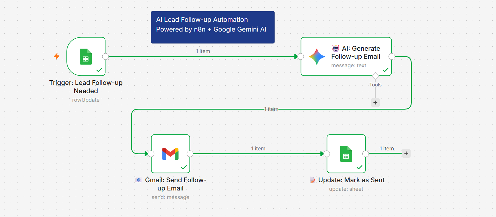
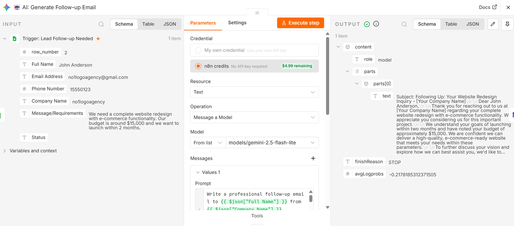
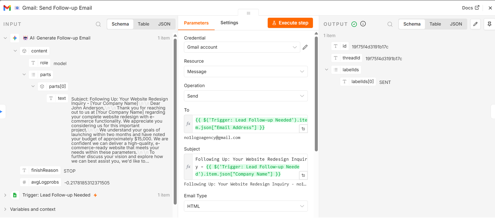
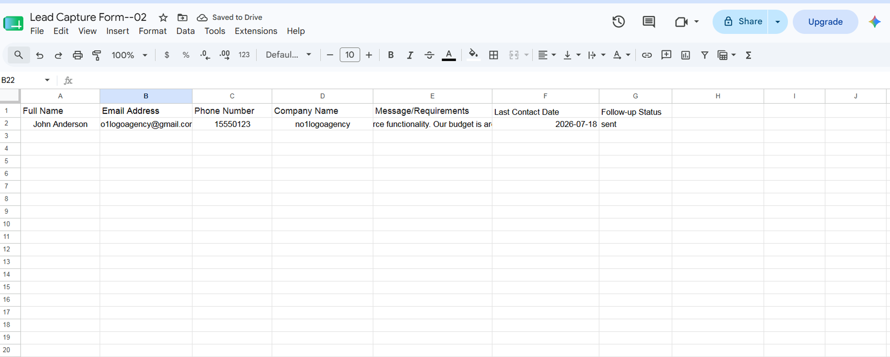
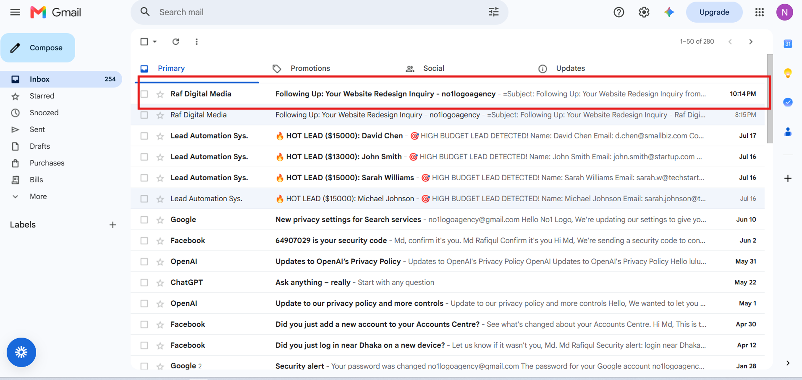

# 🎯 AI Lead Follow-up Automation

> An intelligent automation that generates and sends personalized follow-up emails using AI — reducing manual follow-up time by 95%.

## 🎬 See It In Action

## ✨ Features

- ✅ **Automated Triggering** — Monitors Google Sheets every minute
- 🤖 **AI-Powered Personalization** — Uses Google Gemini 2.5 Flash Lite
- 📧 **Smart Email Generation** — 100-150 word professional emails
- ⚡ **Automatic Sending** — Gmail integration for instant delivery
- 📊 **Status Tracking** — Auto-updates sheets with follow-up status
-  **Professional Tone** — Friendly, helpful, and non-pushy
- 📞 **Consultation CTA** — Includes 15-minute call offer
- ️ **Error Handling** — Graceful failure management

## 🛠️ Tech Stack

| Tool | Purpose |
|------|---------|
| **n8n** | Workflow automation engine |
| **Google Gemini AI** | Email content generation |
| **Google Sheets** | Lead data storage & trigger |
| **Gmail** | Automated email sending |

## 💼 Business Impact

| Metric | Before | After |
|--------|--------|-------|
| Follow-up time | 2-4 hours | < 60 seconds |
| Response time | 24-48 hours | Instant |
| Manual hours/week | 10-15 hours | < 1 hour |
| Missed follow-ups | 30-40% | 0% |

## 🚀 How It Works

Google Sheets (New Lead with Status = "Needs Follow-up")
↓
Google Gemini AI (Email Generation)
↓
Gmail (Send Personalized Email)
↓
Google Sheets (Update Status to "Sent")

## 📸 Screenshots

### Full Workflow

### AI Email Generation

### Email Sent Successfully

### Google Sheets Updated

### Email in Inbox

## 📦 Installation

1. Import `2-ai-lead-followup-automation.json` to your n8n instance
2. Configure Google Sheets credentials
3. Set up Google Gemini API key
4. Configure Gmail credentials
5. Activate workflow and test!

## 💼 Use Cases

- 🏢 **Sales Teams** — Never miss a follow-up
- 💼 **Marketing Agencies** — Nurture leads automatically
- 🛒 **E-commerce** — Follow up on inquiries instantly
- 🏡 **Real Estate** — Respond to property inquiries
- 💻 **Service Providers** — Automate client communication

## 📝 License

MIT License — free to use and modify for personal or commercial projects.

---

**Built with ❤️ using n8n and Google Gemini AI**

*For inquiries or custom automation projects, feel free to reach out!*
